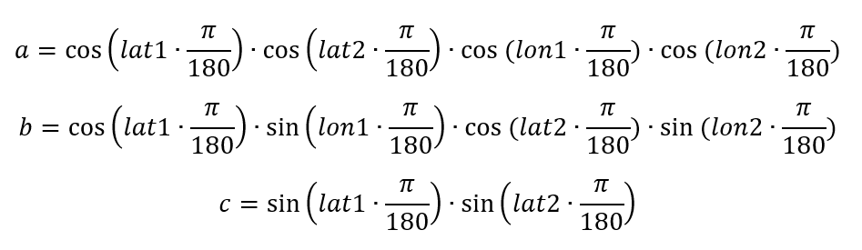
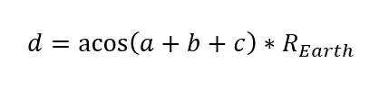
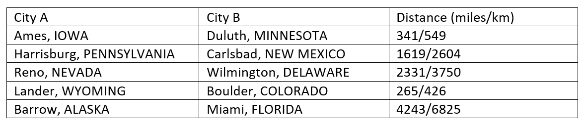

# Geography Toolbox - Problem Statement

For this project, you will fill in various gaps of code to create a user form that determines the distance (as the crow flies) between two cities using latitude (lat) and longitude (lon).  The user form will have one option to enter two US cities (manually typed in) and another option to select states from two combo boxes and cities from two combo boxes (see my examples in this document and in the introductory screencast).

The distance between coordinate 1 (lat1/lon1) and coordinate 2 (lat2/lon2) can be calculated by the following equations (lat and lon are both input in degrees).  First, a, b, and c are determined then these values can be used to calculate distance.

The distance can then be calculated by:

The radius of the Earth, R_Earth=3960 miles = 6370 km (you can choose which units you would like to use).  Importantly, if the absolute value of the acos term is > 1 (acos function is undefined) then you should just approximate the distance between those two points as 0.

On the course website is a starter file called “Geography Toolbox - STARTER.xlsm”.  Sheet1 of this file provides latitude and longitude of hundreds of US cities.  I have already provided the “skeleton” user forms and much of the code, especially for the search part of the user form. 

Please see the introductory screencasts for an orientation into what you are to create for this project as well as an overview of the code that I’ve provided.  Wherever I have written “YOUR CODE GOES HERE”, you must complete the code to make the project work properly. 

You shouldn’t edit or add code to any of the following subroutines: 

- Private Sub SearchButton1_Click()
- Private Sub SearchButton2_Click()

You will need to add code to the following subroutines and functions (sometimes this will be just a line or two of code, sometimes it may be many lines of code): 

​	Module 1: 

- Sub RunForm()
- Sub PopulateStates()

​	UserForm1 

- Private Sub GoButton1_Click()
- Private Sub GoButton2_Click()
- Private Sub state1select_Change()
- Private Sub state2select_Change()
- Function Distance( … )
- Private Sub QuitButton_Click()
- Private Sub ResetButton_Click()

​	UserForm2 

- Private Sub CancelButton_Click()
- Private Sub ContinueButton_Click()

 

**Project Requirements** – Your peers will be grading your project according to the rubric below.  You should verify that your project meets all of these constraints before you submit it!  These are the items that the grader will be looking for! 

​	(1 pt) Geography Toolbox is opened when the button on the main sheet is pressed. 

​	(1 pt) The state combo boxes populate automatically when the user form is opened.  All 50 states (and District of Columbia) are included in both lists. 

​	(1 pt) When the state is changed, the cities will automatically repopulate accordingly (check to make sure the cities align with that newly selected state). 

​	(1 pt) The Quit button on UserForm1 works properly, and if the user form is reopened the combo boxes do not have duplicate items. 

​	(2 pts) The right GO button works and the distance between two points is calculated.  Check several distances using the solution table below (a small amount of error is acceptable):

​	(1 pt) Verify that the Reset button on UserForm1 works properly (resets both left and right sides of the user form). 

​	(1 pt) Type in “chi” into one of the search boxes (left side) and click on the search button.  If Continue is selected after choosing one of the options, it resumes and places that name into one of the labels on the lower left corner of the user form. 

​	(2 pts, 0.5 pt each) Input validation and error handling: 

​	Type in “chi” into one of the search boxes (left side) and click on the search button.  If Cancel is selected, after choosing one of the options, it should NOT display the VBA “debug” box; it should just cancel and exit the sub. 

​	If the cities and states selected from both pairs of combo boxes (right side) are the same, then the user will be notified that they cannot be the same.  Same thing with the left side, the two locations cannot be identical. 

​	If the user leaves one or both of the input boxes blank (left side) and presses Go, there should be an error indicating that at least one input field is blank. 

​	If a city is not found (HINT: if the For… Next loop in the search subroutine is not exited, if Exit For is not executed), the user should be notified. 

**Hints** 

- The Continue button should just hide UserForm2
- General error handling is found in various parts of Part 1 and Part 2 of the course