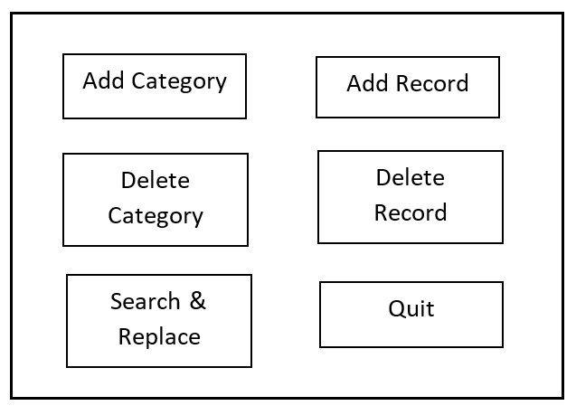
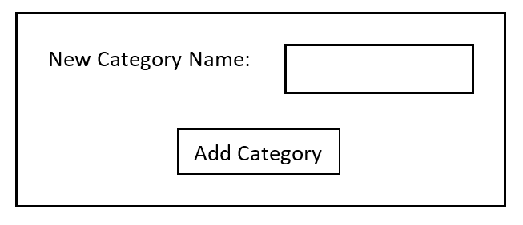
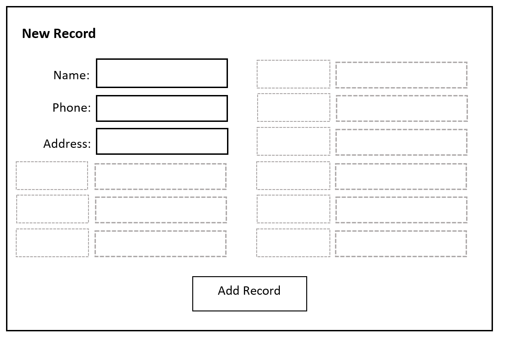
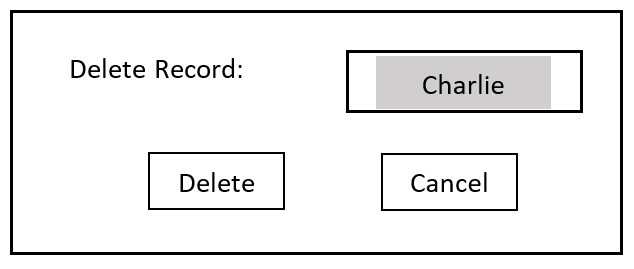

# Ultimate Organizer - Problem Statement

This project has wide-ranging uses and applications.  Create a VBA user form that will: 1) allow the user to add or delete new categories (user-defined) to a data table (these would be the columns/column headings) on a main worksheet, 2) allow the user to add or delete records (a row of a table), and 3) allow the user to look up different categories for a record (basically searching through the data and outputting a specific user-defined category) with the option of replacing those items.  Please see the screencasts related to this project for help and a demonstration of what you are trying to create. 

 

**Requirements**

1) **Main Form**.  The main form should have options to add a category, delete a category, add a new record (row of a table), delete record, and search through the data (by using one of the categories).  A delete confirmation box should appear to confirm deletion of any categories. 

Your main form might look something like this:

2) **Add Category**.  If the user wishes to create a new category, a user form similar to the one below should appear.  This allows the user to input the name of a new category.  This would be the heading of a column of data.  When the user selects “Add Category” then the next available (blank) column would be entitled what the user inputs.  As a simple example, some headings might be “Name”, “Phone Number”, and “Address”.

Hints for this part:

•	Make sure to detect the number of categories that preexist.  You’ll need to count the number of columns that have labels in row 1 of the worksheet.  Then, the new column label will be added after the last of the preexisting columns. 

•	See the screencast “Adding a new category to the spreadsheet”. 

 

3) **Delete Category**.  If the user wishes to delete an entire category (other than the Names category), a user form similar to the one below should appear.  All of the columns are populated in a combo box, with the default being the second column.  This allows the user to select the category that they wish to delete (i.e. an entire column of data from the spreadsheet).  This should be confirmed with a Yes/No message box after “Delete” is clicked!

Hints for this part: 

•	Before bringing up this user form, you’ll need to populate the combo box with all the current category labels, other than the first column (do not delete the names in column A).  See “Introduction to combo boxes” (Parts 1 and 2) in Part 2 (Week 4) of the course for instructions on how to do this. 

•	Record a macro for how to delete a column!  As a hint, Columns("D:D") can also be written as Columns(4).

•	Make sure to have a delete confirmation message box (will be a message box with a return value, see “Advanced message boxes” in Part 2 (Week 4) of the course. 

•	At the end of the code behind the Delete button, you will want to clear the contents of the combo box (something like “DeleteForm.ComboBox1.Clear”) then repopulate it (iterate once again through the remaining categories and add those to the combo box). 

 

4) **Add Record**.  Next, we wish to be able to add records (rows of the table/spreadsheet).  A user form similar to the one below should allow the user to input a new record.  In the example below, I’ve assumed that the user has already created 3 categories (“Name”, “Phone”, and “Address”).  The user form should be able to display up to 12 different categories, so make sure there is extra space in case later on the user adds a new category.  Note that you should have 12 total labels and 12 total text boxes.  If there are currently n categories of data on the worksheet, then only n of the labels and n of the text boxes should be visible; all others should remain hidden.  See the screencasts on how to do this.  In the diagram below, the dotted lines represent that those labels and text boxes are hidden (i.e., not currently being used), but you should allow up to 12 total categories to be used on the spreadsheet.   

Again, there is a lot of space here such that if a new category is added then those new categories will show up.  When the user submits “Add Record”, the items in the user form are added in a single row of the spreadsheet.

Hints for this part: 

•	Before bringing up this form, you will need to deal with showing the labels and text boxes of the relevant categories.  I would recommend starting with all of the labels and text boxes hidden (you can use something like “AddRecordForm.Label1.Visible = False” and “AddRecordForm.TextBox1.Visible = False”, then sequentially show and change the labels of the categories that are present on the spreadsheet.  Then, once all of this has been done, you show this user form (e.g., “AddRecordForm.Show”). 

•	See my screencast on “Revealing hidden labels and text boxes”. 

•	See my introduction screencast for a demonstration of how this form is supposed to work. 

 

5) **Delete Record**.  If the user wishes to delete an entire record (row of the spreadsheet, other than the first row), a user form similar to the one below should appear.  All of the names in column A will appear in a combo box.  This allows the user to select the record (name) that they wish to delete (i.e. an entire row of data from the spreadsheet).  This should be confirmed with a Yes/No message box after “Delete” is clicked!   

Hints for this part:

•	Before bringing up this form, the combo box must be populated with all of the names in column A (other than the first row).  See “Introduction to combo boxes” (Parts 1 and 2) in Part 2 (Week 4) of the course for instructions on how to do this. 

- As a hint, Rows("3:3") can also be written as Rows(3).

•	See my introduction screencast for a demonstration of how this form is supposed to work.  

•	Make sure to have a delete confirmation message box (will be a message box with a return value, see “Advanced message boxes” in Part 2 (Week 4) of the course. 

•	At the end of the code behind the Delete button, you will want to clear the contents of the combo box (something like “DeleteForm.ComboBox1.Clear”) then repopulate it (iterate once again through the remaining rows and add those names to the combo box). 

 

6) **Search/Replace**.  The final aspect of the project is to allow the user to search through records for information and replace or add information.  The user should be able to select one of up to 12 categories (drop-down list) to use as a search criterion.  The user form will then display what the user is searching for and will also allow them to replace the information.  If the user selects to replace an item for a particular row and column, then the change will be permanently made to the worksheet.  If there is no available information for that item, then the user form will ask the user if they would like to add information to that record and category, and the addition should be made permanent on the worksheet (see my introduction screencast on what your project must do). 

Hints for this part:

•	Before bringing up this form, the name combo box must be populated with all of the names in column A (other than the first row).  The second combo box also needs to be populated with the categories (other than the first column).  See “Introduction to combo boxes” (Parts 1 and 2) in Part 2 (Week 4) of the course for instructions on how to do this.  Once these items have been populated, this form can be shown. 

•	When the Search button is pressed, the corresponding item will be displayed in the “Search result” area.  The label (“Address” in my example above) should be modified by the subroutine to coincide with what the user selects from the second combo box (HINT: something like “Label1 = ComboBox2.Text”). 

•	If there is nothing in the corresponding cell of the spreadsheet when the Search button is clicked, then the user form should notify the user that no information currently exists.  It should then ask the user if they’d like to add data for that item.  This should bring up a Yes/No message box; if the user selects Yes (see screencast on “Advanced message boxes” in Part 2, Week 4, of the course), then an input box will allow the user to input the information, and that information will be stored permanently in the spreadsheet. 

•	The Replace button should work similarly – it will ask the user for the new information and will (after a confirmation message box) replace that information permanently on the spreadsheet. 

•	See my introduction screencast for a demonstration of how this form is supposed to work. 

 

7) **Input Validation.** You should make sure that your user form never brings up the “Debug” box and the Visual Basic Editor.  Part 2 (Week 4) of the course has some basic information on input validation for user forms.  There is a lot of input validation and fine tuning that you can do for this project (like what happens if Cancel buttons are pressed, etc.).  You won’t be graded on input validation, but do your best to make sure that there aren’t too many errors encountered during normal operation of your project! 

**Grading Rubric**

•	(1 pt.) The main form should have options to add a category, delete a category, add a new record (row of a table), delete record, and search through the data (by using one of the categories).  It should also have a Quit button. 

•	(1 pts.) The user can properly add a new category, and this category is added in the first empty column of row 1 (going left to right).  Test to verify that this works. 

•	(1 pt.) The user can properly delete an entire category, and there is a warning message box to confirm deletion.  Test to verify that this works. 

•	(2 pt.) The user can properly add a new record (row), and this record is added in the first empty row.  The user form to add a record should adapt to the number of categories currently on the worksheet, and should only reveal labels and input boxes for those categories.  Test to verify that this works. 

•	(1 pt.) The user can properly delete an entire row, and there is a warning message box to confirm deletion.  Test to verify that this works. 

•	(2 pts) The user can search (using a combo box of the items in column A) for a specific category (category items are placed into a second combo box) and the user form displays the result.  Test to verify that this works. 

•	(1 pt.) When the search tool is used, there is an option to replace/modify the preexisting contents.  Test to verify that this works. 

•	(1 pt.) If the item that the user searches for using the search tool is empty/blank, then the user form will detect this and notify the user that there currently is no information.  It should then give them the option to add information.  Test to verify that this works. 

 

**Good Luck!**