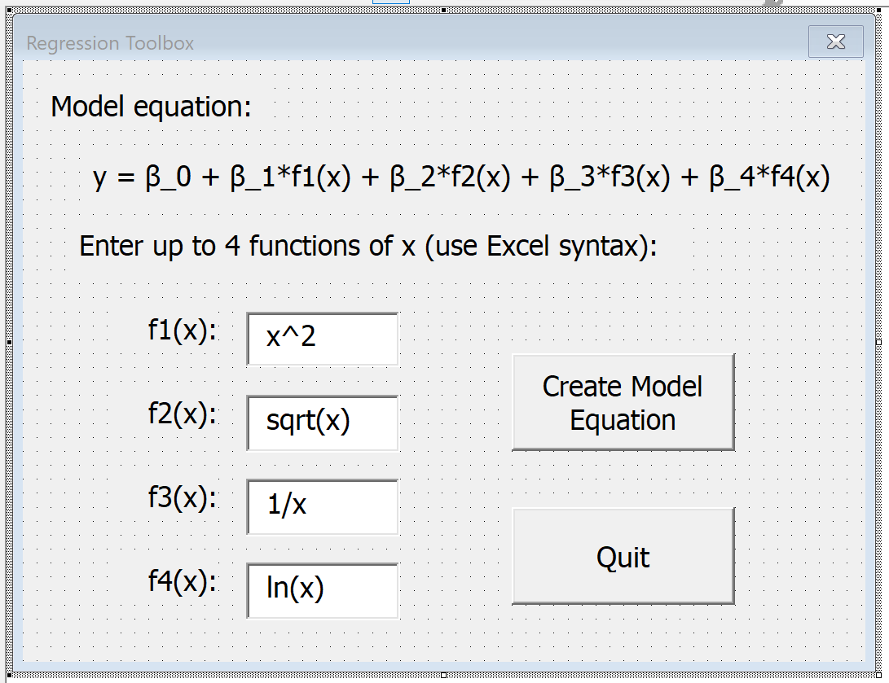
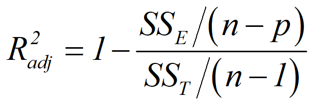

# Regression Toolbox - Problem Statement

Problem Statement 

In this project, you will first familiarize yourself with linear regression models and then you will create a user form that will allow the user to create a custom linear regression model using a user-hypothesized/chosen form of the model.  The user form will fit x-y data provided on the spreadsheet to the chosen model and will output the model parameters and the adjusted R-squared value, which is a measure of how well the model fits the experimental data.  Finally, your user form should give the user the option to plot the experimental data (as markers, no line) and the model predictions (no markers, solid and smooth line) on the same plot.  See the introductory screencast related to this project for a demonstration of what you are trying to create.

Project Requirements 

- Your approach should utilize the matrix approach to linear regression (see the many screencasts on this).
- The user should be able to enter up to 4 functions of x in the user form.  Assume that these are input just like normal Excel syntax.
- (3.5 pts) Correctly calculates model coefficients of a set of data for a given hypothesized model.
- (0.5 pt.) Your Regression Toolbox pops up when a button on the main sheet is pressed.
- (2 pts)  Input Validation
- (0.5 pt.) An error message should result if all of the fields are empty
- (1 pt.) If a field is left empty, then the regression model will be performed with all other non empty terms.  For example, if f3(x) is empty, the model with all other terms will be created.  The functions DO NOT have to be sequential; input fields can be left blank and the tool will use all other non-blank functions to create a regression model.
- (0.5 pt.) An error message will be displayed if n functions are input on the form and there aren’t at least (n+2) data points selected.  For example, if the user selects a model with 4 functions (5 parameter model) but there are only 5 pairs of x-y data, this is not allowed and there should be a warning message indicating that there need to be at least (n+2 = 6) pairs of x-y data.
- (0.5 pt.) Your Quit button must work.
- (1 pt.) The adjusted R-squared value must be output by your user form.
- (2.5 pts) Your user form should ask the user (in a message box) if they’d like to plot the data.  If they choose yes, then you’ll need to make a plot of the experimental data as markers (no line) and the model prediction as a smooth line (no markers).  These two series should be on the same plot (see screencast on this).

 

About the “Regression Toolbox – STARTER.xlsm” file 

I’ve got a starter/template file that you can use for this project.  I’ve got some helpful things in the code already, but wherever I write in green “PLACE YOUR CODE HERE” means that you need to put significant code in that spot. 

The image below shows the skeleton user form available in this starter file.

How to calculate adjusted R-squared:

There is a good screencast related to this, but the equation for calculating adjusted R-squared is provided here:

In this equation, n is the number of experimental data points, p is the number of parameters (the number of functions entered in the user form plus one for the intercept), and SSE and SST can be calculated from the following equations:

Again, there are some great screencasts that go into these calculations in a lot more detail.

 

Hints and notes: 

•	You’ll have to do different things based on the number of boxes that have formulas in them.  You can use something similar to: “If Not fxn1 = “” Then”… 

•	Make sure to use Unload UserForm1 instead of hiding it; I had some issues related to this and plotting 

•	The screencast “Multilinear regression” was more for your benefit; the project here is just a general linear regression (single regressor variable).