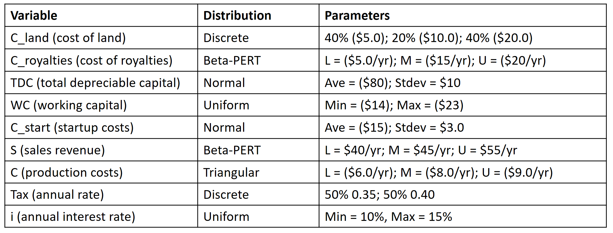
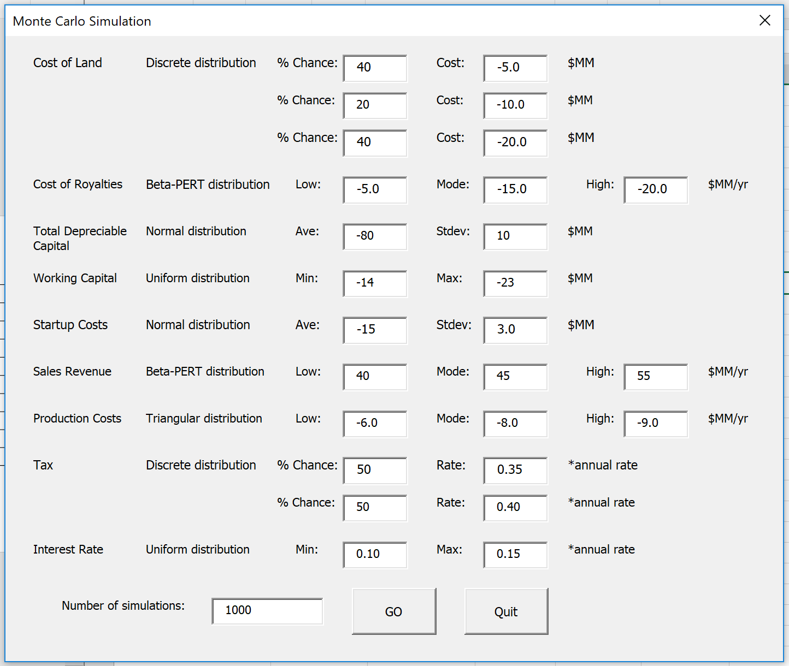

# Monte Carlo Simulation Problem Statement

**Introduction**

A great tool for investigating uncertainty in a complex process is the Monte Carlo simulation.  If you'd like, there is plenty of information online that describes what this simulation does and what it is useful for.  But in brief, a Monte Carlo simulation aims to simulate the possible pathway of a future endeavor, experiment, or process, given multiple inputs that each have uncertainty.  Monte Carlo simulations are oftentimes used by financial planners to try to predict what might happen in the future.  Inputs to financial planning processes include probabilities of how the stock market might do, projections for various costs and amount of sales, and many other financial variables.  In the sciences, there may be several or many inputs into a future process, and the goal is to understand the likelihood of a scenario going one way or another.

In this project, you will first learn about a Monte Carlo simulation and how to implement it in a VBA user form using an example investigating a cookie recipe, where each of the ingredients has an uncertainty associated with it.  You will explore five different typical distributions used in Monte Carlo simulations and implement these into the VBA user form.  Finally, you will adapt the cookie example into the main project deliverable, which is a user form that allows the user to simulate a profitability analysis based on net present value (NPV) of a proposed capital project.

Your project will be graded/evaluated by 3 different peer reviewers according to the rubric below.

**Grading Rubric:**

1. (4 pts)  User is able to input bounds for the various distributions as indicated in the problem statement. When the GO button is clicked, the simulation works (does not crash) for at least 1,000 simulations. Basically, 5 points awarded for setting up the user form and running the simulations. The accuracy of the simulation will be tested in the next rubric portion.
2. (2 pts)  The percentage of simulations that resulted in positive net present value (NPV) is output in a message box.
3. (3 pts)  The peer graders will then test the project for accuracy. They will input into the Monte Carlo simulation a set of values for the various distributions. Your simulation should output a result that is close to the solution (+/- 2%).  You can pre-check your Monte Carlo simulation below (see "How to check to make sure your Monte Carlo simulation is working").  *The peer reviewers will test a different combination of the various inputs*.
4. (1 pt)  The results of the simulation are output successfully in a histogram (based on the code provided by the starter files).

**How to check to make sure your Monte Carlo simulation is working**  

In order to determine before grading whether your simulation is working properly, you can test it for the following set of values.  Make sure that you double-check the inputs and make note that values in parentheses are negative quantities.

And this is what the user form might look like (feel free to create your form however you wish, as long as it has spaces for the relevant inputs).

The result of this simulation should be that approximately **40% (+/- 5%)** of simulations are profitable.

**HINTS**

- Sometimes if you are getting unexpected results from calculations involving variables that are input into text boxes on a VBA user form, you can trick VBA into thinking it is a number by simply multiplying by 1.  For example, if I had a text box named "saleslow", VBA would initially recognize this as a string (and you can verify in the Locals window).  To trick VBA into thinking this is a number (sometimes you'll have issues with using these in mathematical formulas), then you can just multiply by 1 (wherever you want to use the saleslow value, you would replace it with 1*saleslow).  This may help you a great deal.  See the next bullet point for an example.
- The Beta_Inv function (borrowed from Excel) cannot have negative arguments.  Instead, make the arguments positive, perform the calculation using the Beta_Inv function, then negate the output at the end (this is essentially just flipping about the y-axis then flipping it back).  As an example, I used the following code in my user form at one point since "royaltieslow" and "royaltieshigh" are negative quantities: "-WorksheetFunction.Beta_Inv(Rnd, alpha, beta, -1 * royaltieslow, -1 * royaltieshigh)".  NOTE the multiplication by 1 (see bullet point above this one).  *You may have to do the same thing with the triangular_inverse function that I provided.*